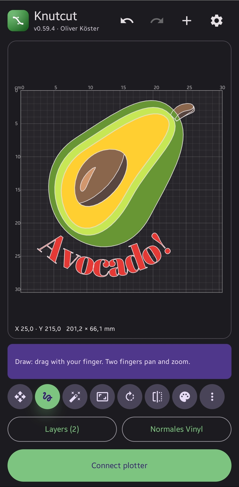
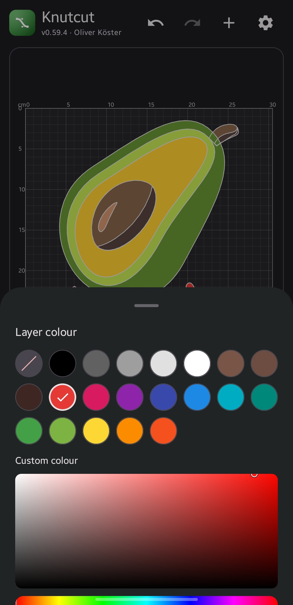
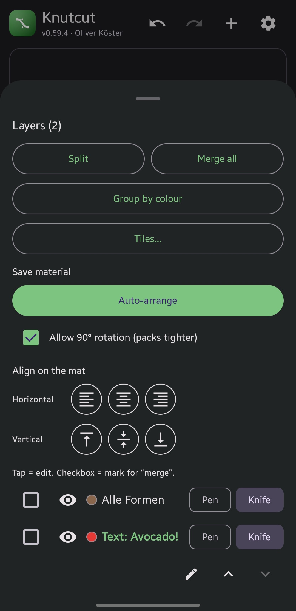
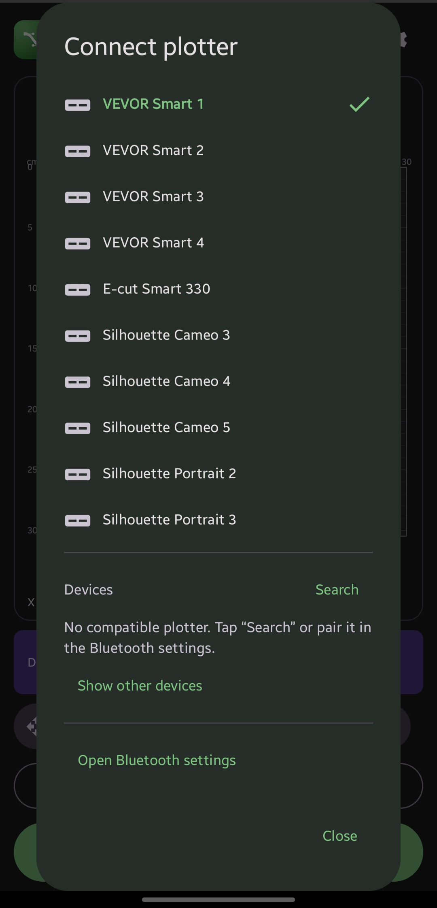
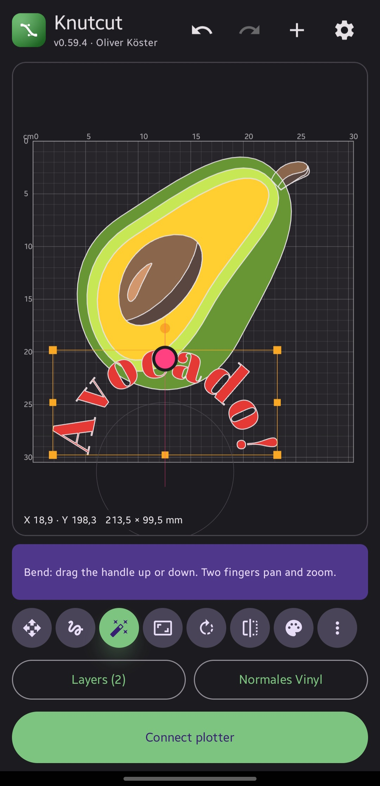

# Knutcut

  

  <b>Cut your own SVGs on a VEVOR Smart, E-cut, or Silhouette plotter, straight from your phone.</b>

  

  Android · German &amp; English · no account, no login

---

Share an SVG to Knutcut (say, from Cricut Export), place and scale it on the mat, send it to the cutter over Bluetooth. That is the whole app.

The software that ships with these plotters wants a login, ships a broken German translation, and won't take a shared SVG. Knutcut does the part I need, in code I control.

## Screenshots

<table>
  <tr>
    <td align="center" width="25%"> <b>Per-layer colour</b></td>
    <td align="center" width="25%"> <b>Layers &amp; nesting</b></td>
    <td align="center" width="25%"> <b>Plotter picker</b></td>
    <td align="center" width="25%"> <b>Bend &amp; transform</b></td>
  </tr>
</table>

## Features

**Mat editor.** Place, scale, rotate, mirror, and duplicate your design on a true-to-size mat with a mm grid and cm ruler. Pinch to zoom and pan, drag to move, snap to the guides. Undo and redo every step.

**Layers.** Rename, reorder, show or hide, and recolour each layer. Group by colour, merge or split, and tile a layer into an n×m grid to fill the sheet. Auto-arrange packs everything tight to save material, with optional 90° rotation.

**Colour.** Give every layer its own colour from the swatch palette or a full HSV picker with hex input, so the design on screen matches the vinyl you cut.

**Shapes and text.** Draw freehand, drop in shapes, or set text in outline and single-stroke (Hershey) fonts. Convert any shape to editable nodes and bend it by hand.

**Open and export.** Reads SVGs from any editor, Inkscape, Illustrator, or CorelDraw, whatever the file encoding (CorelDraw's UTF-16 exports included). Open or share SVG and PLT files, then export the whole design back out as a real-size SVG with every layer and colour, ready to re-open anywhere.

**Cut.** Send to a VEVOR Smart or E-cut over classic Bluetooth, or to a Silhouette over Bluetooth LE. Pick a material preset or set pressure, knife compensation, and the number of passes yourself. Assign pen or knife per layer.

**Stays current.** Knutcut checks the releases repo on launch and offers the new version, verified by SHA-256 before it installs.

## Supported plotters

- VEVOR Smart 1 / 2 / 3 / 4 over classic Bluetooth (HPGL)
- E-cut Smart 330, the same hardware as the VEVOR Smart 1
- Silhouette Cameo 3 / 4 / 5 and Portrait 2 / 3 over Bluetooth LE (GPGL)

Don't see yours listed? Tap **Search** to pair any device, or jump into the Bluetooth settings from the dialog.

## Install

1. Grab the latest APK from the [releases page](https://github.com/knutwurst/knutcut-releases/releases).
2. Open it on your phone and allow the install. It is signed with a stable release key.
3. From then on Knutcut updates itself and offers each new release on launch.

## Build

Uses the same local toolchain as cricut-export (Android SDK and Gradle under `tools/`, JDK 17).

    cd android
    ./gradlew :app:assembleRelease     # installable APK
    ./gradlew test                     # unit tests

## Layout

- `svgcore`: pure Kotlin, no Android. Turns an SVG into mm geometry and then into the plotter command stream (HPGL for VEVOR, GPGL for Silhouette). Unit-tested on the JVM, so cricut-export can reuse it.
- `app`: Compose UI (share target, mat editor, material picker, cut flow) plus the two Bluetooth transports, classic Serial (SPP) for VEVOR and E-cut and Bluetooth LE (GATT) for Silhouette.

See [CHANGELOG.md](CHANGELOG.md) for the per-release history and `docs/` for the design and protocol notes.

## Notes

Personal project for my own hardware, with only my own code. The plotter protocol is reimplemented from watching my own device. No third-party app code or assets are included.
